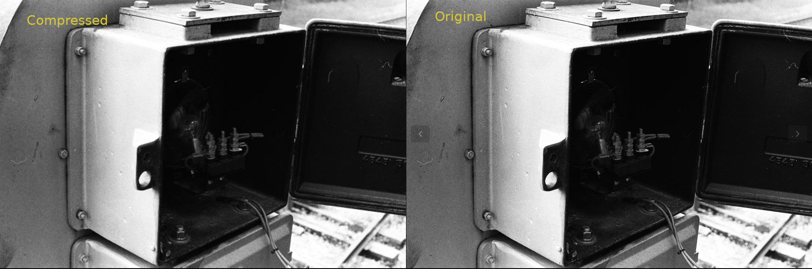

## Optimize Images Using Bicubic Interpolation Algorithm

### Overview
Experiment with Bicubic Interpolation to resize a reduced image back to a 1080p resolution image or greater using python.

### Results


**note: image tested is a high resolution 35mm film scan**

#### Using Bicubic Interpolation
Reducing an image of ```6048 x 4011``` resolution by a factor of 10 then resizing the image back up to half it's original resolution ```3024 x 2006``` using bicubic interpolation to replace the missing pixels, reduced the file size from ```5.2mb``` to ```756.7kb```. This leads to an approximate 86% reduction in file size. 

```
(1 - (756.7kb / 5427.2kb)) * 100 ≈ 86%
-> 756.7kb / 5427.2kb ≈ .13 
-> 1 - .13 = .86
-> .86 * 100 ≈ 86%
```

The quality is passable, in my opinion.
While impressive, the trade off is compute time. It took a little over 10 minutes to compress this image.

#### Using Reduce Method found in PIL
Included in the script is the option to do a "simple reduction." A simple reduction uses the reduce method from the ```PIL``` library. The reduce method reduces an image by a factor of x, where x is an int. This can reduce the size of a file in less than a second and several files in seconds. The downside to using the reduce method is the image is reduced by a factor of "x" meaning the dimensions of the image are simply made reduced with the aspect ratio maintained. An of image(../images/box.jpg) with a resolution of ```6048 x 4011``` will reduce to ```1512 x 1003```, 1/4 its original resolution with an approximate 91% reduction in file size.

```
(1 - (534.1kb / 5427.2kb)) * 100 ≈ 91%
-> 534.1kb / 5427.2kb ≈ .09
-> 1 - .09 = .
-> .91 * 100 ≈ 91%
```

## Conclusion
Opting for simple reduction is faster and in most cases desired, as the user could simply use an optimal factor of reduction that best suits their use case, but the image will greatly lose clearity if the user decides to transform their image to a larger size. The bicubic interpolation algorithm to resize a reduced image allows for some additional clearity if the user decides to transform their image to a larger size.